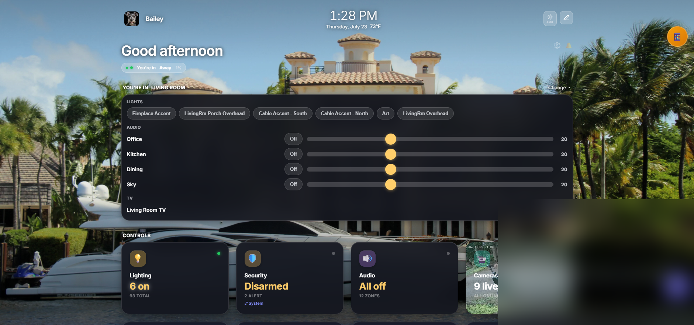

<h1 align="center">BaileyOS</h1>

<p align="center">
  Open source smart home platform. One dashboard. Every device. No cloud.
</p>

<p align="center">
  
</p>

<p align="center">
  <a href="#features">Features</a> |
  <a href="#supported-devices">Devices</a> |
  <a href="#quick-start">Quick Start</a> |
  <a href="#architecture">Architecture</a> |
  <a href="CONTRIBUTING.md">Contribute</a> |
  <a href="https://baileyos.com">Website</a>
</p>

---

## What is BaileyOS?

BaileyOS is a fully local, privacy-first smart home platform. It runs on your hardware, connects to your devices over your local network, and never phones home. No cloud account required. No subscriptions. No telemetry. Just your house, your data, your control.

## Features

- **Single dashboard** for lights, cameras, audio, locks, gates, and more
- **Plugin-based architecture** -- each device type is an isolated plugin
- **Fully local** -- everything runs on your network, nothing leaves your house
- **No cloud dependency** -- works even if your internet goes down
- **Real-time status** -- live device states via Server-Sent Events
- **Multi-protocol support** -- serial, TCP, HTTP, MQTT, and proprietary protocols
- **Low resource usage** -- runs on a Raspberry Pi or any old laptop
- **Web-based UI** -- access from any browser on your network
- **Open plugin API** -- write your own device drivers in TypeScript

## Supported Devices

BaileyOS ships with 18 device plugins covering cameras, lighting, audio, locks, gates, climate, and AV equipment.

| Plugin | Protocol | Description |
|--------|----------|-------------|
| annke-cameras | RTSP/ONVIF | Annke IP camera integration |
| apple-tv | AirPlay/DACP | Apple TV control and status |
| audio-bridge | Virtual | Audio routing bridge between zones |
| av-devices | IR/RS-232 | AV receiver and device control |
| broadlink | RF/IR | Broadlink RM series RF and IR blaster |
| centralite-elegance | Serial (LiteJet) | Centralite Elegance lighting system via LiteJet protocol |
| device-registry | Internal | Central device registration and discovery |
| elk-m1 | TCP | ELK M1 security panel integration |
| esphome-satellite | HTTP/mDNS | ESPHome voice satellite and sensor bridge |
| htd-lync12 | TCP (GW-SL1) | HTD Lync 12-zone whole-home audio |
| lg-tv | WebSocket | LG webOS TV control |
| mitsubishi-projector | RS-232/TCP | Mitsubishi projector serial control |
| rainbird | HTTP | Rain Bird irrigation controller |
| ratgdo | MQTT | ratgdo garage door opener (ESPHome-based) |
| reolink-cameras | HTTP/RTSP | Reolink IP camera integration |
| shelly-gate | HTTP/MQTT | Shelly relay gate controller |
| ttlock | Cloud API | TTLock smart lock control |
| xmeye-cameras | XMEye | XMEye/DVR camera system integration |

For full details, see [docs/supported-devices.md](docs/supported-devices.md).

## Quick Start

```bash
git clone https://github.com/baileyos/baileyos.git
cd baileyos
npm install
npm run dev
```

Open your browser to `http://localhost:3333` and you will see the BaileyOS dashboard.

## Hardware Requirements

BaileyOS is designed to run on minimal hardware. You do not need a powerful machine.

| Tier | CPU | RAM | GPU | Cost |
|------|-----|-----|-----|------|
| Minimum | Any dual-core (x64 or ARM) | 2 GB | None | Free (old laptop, Pi 4) |
| Recommended | Quad-core | 4-8 GB | None | USD 50-150 (used mini PC) |

A Raspberry Pi 4 with 4 GB RAM is a solid choice. Any old laptop or mini PC sitting in a drawer will work fine.

For details on hardware tiers including paid add-ons, see [docs/hardware-requirements.md](docs/hardware-requirements.md).

## Architecture

BaileyOS uses a plugin-based architecture. The core platform handles:

- Plugin lifecycle (load, start, stop, health checks)
- Device registry and state management
- Dashboard UI and API routing
- Server-Sent Events for real-time updates

Each device integration is a self-contained plugin. Plugins are loaded from the `plugins/` directory at startup. They register their devices, expose API routes, and emit state changes. If a plugin crashes, the rest of the system keeps running.

```
baileyos/
  core/           -- platform core (server, registry, SSE, dashboard)
  plugins/        -- device plugins (one folder per integration)
    annke-cameras/
    centralite-elegance/
    htd-lync12/
    ...
  dashboard/      -- web UI
  docs/           -- documentation
```

To create your own plugin, see [docs/creating-a-plugin.md](docs/creating-a-plugin.md).

## Contributing

We welcome contributions of all kinds -- new device plugins, bug fixes, documentation, and testing.

- Read [CONTRIBUTING.md](CONTRIBUTING.md) for the contribution workflow
- Read [docs/creating-a-plugin.md](docs/creating-a-plugin.md) to build a device plugin
- Read [CODE_OF_CONDUCT.md](CODE_OF_CONDUCT.md) for community guidelines

## BaileyOS Pro

The open source Community edition gives you a complete smart home dashboard with device control and status monitoring.

Want more? **BaileyOS Pro** adds:

- Automation rules and scenes
- Facial recognition and presence detection
- Voice identification
- Local LLM intelligence (runs on your hardware, still no cloud)

Visit [baileyos.com](https://baileyos.com) to learn more.

## Security

To report a security vulnerability, see [SECURITY.md](SECURITY.md).

## License

BaileyOS Community is licensed under the [Apache License 2.0](LICENSE).

Copyright 2026 Imagination 2 Reality LLC.
